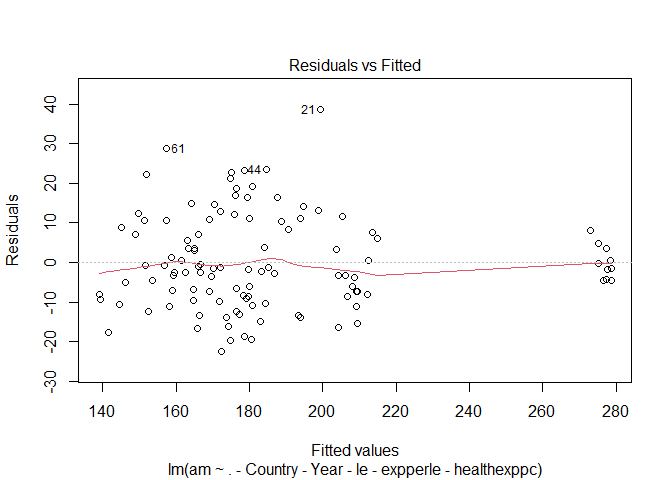
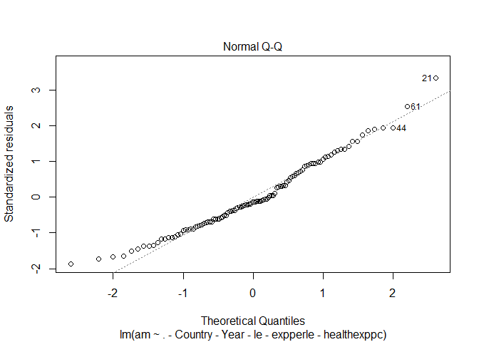
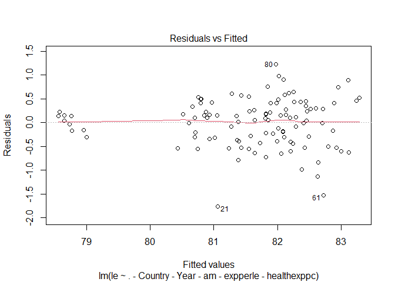
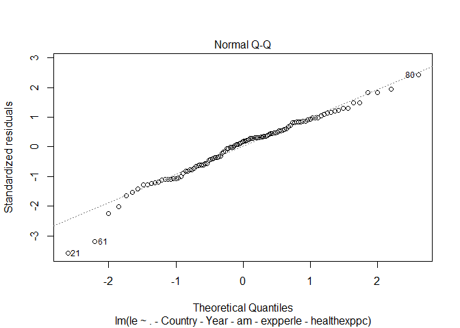

##HealthyNations Linear Regression ####\# **2010-2019 data from the
[OECD](https://stats.oecd.org/)**

Data .csv files can be found in this [**HealthyNations
Repository**](https://github.com/DanielCusick/HealthyNations)

**Response Variables**

-   [**Avoidable mortality deaths per
    100,000**](https://www.oecd-ilibrary.org/sites/3b4fdbf2-en/index.html?itemId=/content/component/3b4fdbf2-en)
-   Life Expectancy at Birth

**Independent Categorical Variable for Health System**

-   Classified countries as “Single” and “Other” based on profiles from
    [**The Commonweatlh
    Fund**](https://www.commonwealthfund.org/publications/2019/apr/considering-single-payer-proposals-lessons-from-abroad).
-   The following countries were labeled “single payer” based on the
    dominant role of government in financing medical care (regardless of
    the level of government): Canada, Denmark, France, Norway, Sweden
    and the United Kingdom
-   Germany, the Netherlands and Switzerland all employ regulated and
    subsidized nonprofit private insurers, while [**Australia has a
    hybrid
    system**](https://www.pbs.org/video/the-best-health-care-1599164339/)
    where many citizens opt to purchase private insurance as their
    primary coverage.
-   U.S. classified as “America”

**Other variables included**

-   Sugar, fruit and vegetable supply per capita
    -   This data was more complete than survey data on daily
        consumption. The assumption here is supply equals (or is
        proportional to) demand
-   Percentage of population who are daily tobacco smokers
-   Alcohol consumption in liters per capita
-   Percentage of the population who is obese, self-reported
    -   Measured statistics were not as complete as the self-reported
-   Percentage of the population subjected to air pollution exceeding
    the WHO Air Quality Guideline value of 10 micrograms per cubic
    meter.
-   Percentage of the population who feels safe walking around their
    neighborhood at night
-   External deaths per 100,000
    -   Includes traffic accidents, accidental falls, accidental
        poisoning (drug overdoses), suicides, and homicides

Set-up includes data.table package

``` r
# Paths
projpath <- "C:/Users/dancu/Documents/Fall2022_ADEC743002"
# subfolders
rawdata <- file.path(projpath, "RawData")
finaldata <- file.path(projpath, "FinalData")
```

#### **Read in final health16 dataset**

``` r
health16<-read.csv(file.path(finaldata, "health16.csv"))
health16$system<-as.factor(health16$system)
str(health16)
```

    ## 'data.frame':    110 obs. of  17 variables:
    ##  $ X              : int  1 2 3 4 5 6 7 8 9 10 ...
    ##  $ Country        : chr  "Australia" "Australia" "Australia" "Australia" ...
    ##  $ Year           : int  2010 2011 2012 2013 2014 2015 2016 2017 2018 2019 ...
    ##  $ am             : num  170 168 161 160 162 162 156 154 151 156 ...
    ##  $ le             : num  81.7 81.9 82 82.1 82.3 82.4 82.4 82.5 82.7 82.9 ...
    ##  $ sugkilospc     : num  131 129.5 129.6 129.7 43.9 ...
    ##  $ frukilospc     : num  80.4 74.2 75.9 73.5 71 70.8 76.8 75.4 70.6 65.5 ...
    ##  $ vegkilospc     : num  98.8 93.3 96.4 101.9 86.7 ...
    ##  $ pctdailysmokers: num  15.3 13 13 13 13 13 12.4 13 13 11.2 ...
    ##  $ alcliterspc    : num  10.4 10.2 10 9.9 9.7 9.8 9.5 9.5 9.9 9.9 ...
    ##  $ obspct         : num  19.5 19.5 19.5 19.5 19.5 19.5 19.5 19.5 19.5 19.5 ...
    ##  $ pollutpoppct   : num  0.004 0.004 0.004 0.004 0.004 0.004 0.004 0.004 0.004 0.004 ...
    ##  $ feelsafepct    : num  63.6 63.9 65.4 66.7 62.3 ...
    ##  $ healthexppc    : num  3593 3809 3854 4088 4556 ...
    ##  $ expperle       : num  44 46.5 47 49.8 55.4 ...
    ##  $ extdeathper100k: num  42.5 43.4 43.1 41.4 45 46.4 45.6 45.8 45.5 47.9 ...
    ##  $ system         : Factor w/ 3 levels "America","Other",..: 2 2 2 2 2 2 2 2 2 2 ...

``` r
names(health16)
```

    ##  [1] "X"               "Country"         "Year"            "am"             
    ##  [5] "le"              "sugkilospc"      "frukilospc"      "vegkilospc"     
    ##  [9] "pctdailysmokers" "alcliterspc"     "obspct"          "pollutpoppct"   
    ## [13] "feelsafepct"     "healthexppc"     "expperle"        "extdeathper100k"
    ## [17] "system"

``` r
health16<-health16[,-1]
```

#### **Run Models**

The first model shows single payer systems are associated with 90 fewer
annual avoidable deaths per 100,000 relative to the U.S. system. The
second model shows single payer systems are associated with 4 additional
years of life expectancy. Both models have an R-squared measure above
0.8. The residual diagnostics are better than I expected without any
transformations. It’s also worth noting the “Other” universal
government-regulated systems perform better than both the single payer
and U.S. categories. This provides a great lead for future research.

#### **Avoidable Mortality**

``` r
# Avoidable Mortality Linear Regression
lmod<-lm(am ~ . - Country - Year -le - expperle - healthexppc, health16)
summary(lmod)
```

    ## 
    ## Call:
    ## lm(formula = am ~ . - Country - Year - le - expperle - healthexppc, 
    ##     data = health16)
    ## 
    ## Residuals:
    ##     Min      1Q  Median      3Q     Max 
    ## -22.495  -8.518  -1.706   8.243  38.674 
    ## 
    ## Coefficients:
    ##                   Estimate Std. Error t value Pr(>|t|)    
    ## (Intercept)      222.50557   42.76336   5.203 1.08e-06 ***
    ## sugkilospc         0.34260    0.08446   4.056 0.000100 ***
    ## frukilospc        -0.07786    0.16637  -0.468 0.640849    
    ## vegkilospc        -0.47887    0.15305  -3.129 0.002311 ** 
    ## pctdailysmokers   -2.50212    0.68688  -3.643 0.000433 ***
    ## alcliterspc        8.10939    2.86630   2.829 0.005660 ** 
    ## obspct             1.69480    0.72673   2.332 0.021742 *  
    ## pollutpoppct       0.35131    0.08481   4.142 7.30e-05 ***
    ## feelsafepct        0.42338    0.28029   1.510 0.134135    
    ## extdeathper100k   -0.47872    0.32766  -1.461 0.147208    
    ## systemOther     -123.01891   16.15945  -7.613 1.68e-11 ***
    ## systemSingle     -90.13260   14.17943  -6.357 6.55e-09 ***
    ## ---
    ## Signif. codes:  0 '***' 0.001 '**' 0.01 '*' 0.05 '.' 0.1 ' ' 1
    ## 
    ## Residual standard error: 12.52 on 98 degrees of freedom
    ## Multiple R-squared:  0.8928, Adjusted R-squared:  0.8808 
    ## F-statistic: 74.19 on 11 and 98 DF,  p-value: < 2.2e-16

``` r
plot(lmod, which=1)
```



``` r
plot(lmod, which=2)
```



#### **Life Expectancy**

``` r
# Life Expectancy Linear Regression
lmod2<-lm(le ~ . - Country - Year -am - expperle - healthexppc, health16)
summary(lmod2)
```

    ## 
    ## Call:
    ## lm(formula = le ~ . - Country - Year - am - expperle - healthexppc, 
    ##     data = health16)
    ## 
    ## Residuals:
    ##      Min       1Q   Median       3Q      Max 
    ## -1.76027 -0.31635  0.09481  0.32353  1.22739 
    ## 
    ## Coefficients:
    ##                  Estimate Std. Error t value Pr(>|t|)    
    ## (Intercept)     76.121625   1.803435  42.209  < 2e-16 ***
    ## sugkilospc      -0.017373   0.003562  -4.877 4.16e-06 ***
    ## frukilospc       0.002510   0.007016   0.358   0.7213    
    ## vegkilospc       0.028665   0.006454   4.441 2.35e-05 ***
    ## pctdailysmokers  0.132379   0.028968   4.570 1.42e-05 ***
    ## alcliterspc     -0.329499   0.120879  -2.726   0.0076 ** 
    ## obspct          -0.010538   0.030648  -0.344   0.7317    
    ## pollutpoppct    -0.015532   0.003577  -4.342 3.44e-05 ***
    ## feelsafepct     -0.003436   0.011821  -0.291   0.7719    
    ## extdeathper100k  0.032428   0.013818   2.347   0.0209 *  
    ## systemOther      5.212340   0.681483   7.649 1.42e-11 ***
    ## systemSingle     3.993997   0.597981   6.679 1.46e-09 ***
    ## ---
    ## Signif. codes:  0 '***' 0.001 '**' 0.01 '*' 0.05 '.' 0.1 ' ' 1
    ## 
    ## Residual standard error: 0.5279 on 98 degrees of freedom
    ## Multiple R-squared:  0.835,  Adjusted R-squared:  0.8165 
    ## F-statistic: 45.09 on 11 and 98 DF,  p-value: < 2.2e-16

``` r
plot(lmod2, which=1)
```



``` r
plot(lmod2, which=2)
```


